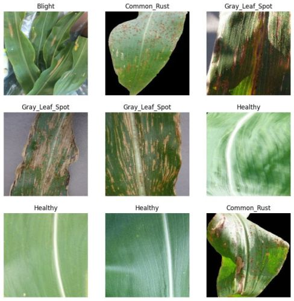
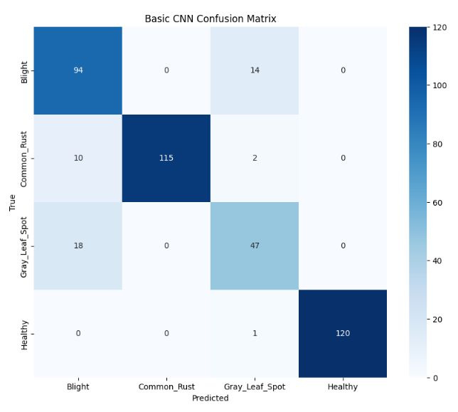

<h1 align="center">Maize Disease Detection using CNN</h1>

<h4 align="center">Detecting diseases in maize plant leaves using convolutional neural network</h4>

 

Credit: SMARANJIT GHOSE

<h2>Table of Contents</h2>

- [Overview](#overview)
- [Dataset](#dataset)
- [Model](#model)
- [Result](#result)

<h2>Overview</h2>

This project focuses on detecting diseases in maize plant leaves using a Convolutional Neural Network (CNN) model. My goal is to accurately classify different conditions of corn or maize leaves, such as Common Rust, Gray Leaf Spot, Blight, and Healthy.

<h2>Dataset</h2>

The dataset I used was obtained from <a href="https://www.kaggle.com/datasets/smaranjitghose/corn-or-maize-leaf-disease-dataset/">Kaggle</a>.

This dataset is specifically designed for classifying corn or maize plant leaf diseases. It is categorized into four classes, each representing a different condition of corn or maize leaves:

- Common Rust: 1,306 images
- Gray Leaf Spot: 574 images
- Blight: 1,146 images
- Healthy: 1,162 images

<h2>Model</h2>

To classify the different conditions of corn or maize leaves, I employed a Convolutional Neural Network (CNN) model using the Keras Sequential API. The model was compiled with the Adam optimizer and Sparse Categorical Crossentropy loss function, and it was trained over 15 epochs. Also, in order to reduce overfitting, I used a dropout layer with a rate of 20%.

<h2>Result</h2>

After training the model, I evaluated its performance on the test set. The model achieved 89% accuracy, 90% precision and 90% F1-score on the test set, which is quite impressive. The model was able to classify the different conditions of corn or maize leaves with high accuracy.

From the confusion matrix however, the model misclassified 18 maize leaves affected with gray leaf spot as blight. This is due to the fact that we have less number of images (574) for gray leaf spot compared to other classes. To improve the model performance, we can apply techniques such as data augmentation or collect more data for this disease class.

